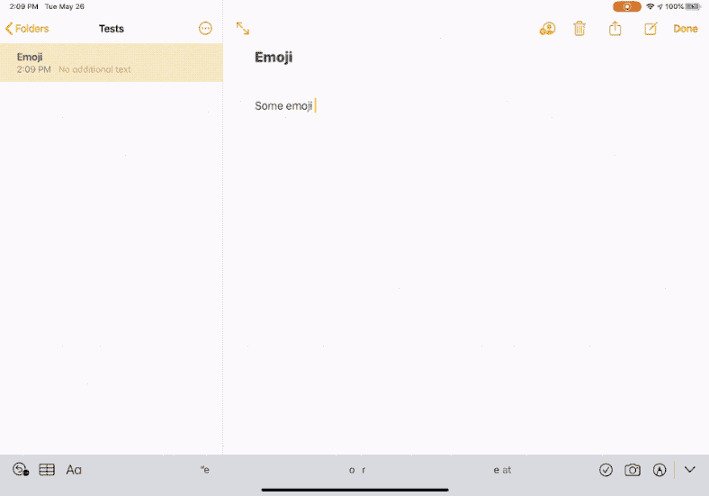

# EmojiPickerUI

A framework implementing a macOS-style emoji picker for iPadOS.

**This is an experiment I've done to see what an emoji picker window would feel like to use on iPad. It is not intended for use in production apps. In the demos I've shown, I was using the system emoji database, which can be gathered from a private framework, this sample code includes a basic, builtin database of emoji.**

[Demo on YouTube](https://www.youtube.com/watch?v=iwfF5nwqEuw)